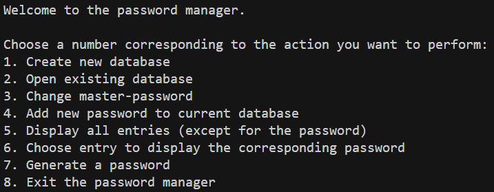

# PasswordManager

This is a terminal-based password manager using sqlite3. \
When starting the program, the user is promted with the following display; \
\

The User are to enter a number corresponding to the action to perform.

All added passwords will de encrypted with a modified ceasar encryption. \
To be able to wiew the entries in the database, the user have to enter a
master password which is set when the database is created. \
The master password is hashed and saved in a text file when created. \
The master password can be changed.

To compile with a makefile on windows: `mingw32-make` \
After compilation, run the program with; `.\bin\pwdManager.exe`

The files regarding the sqlite3 database was downloaded from: https://www.sqlite.org/download.html \
The exact zip that was downloaded was: `sqlite-amalgamation-3420000.zip`
